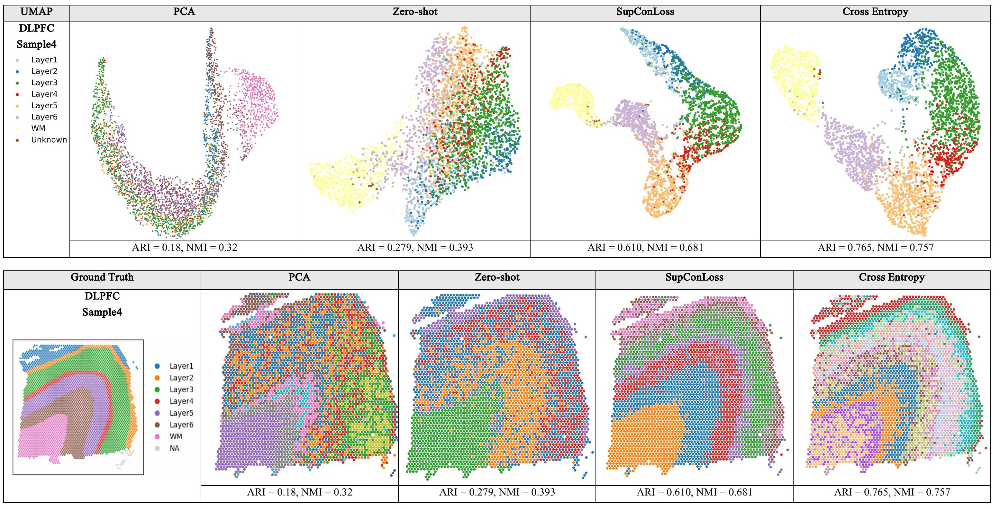
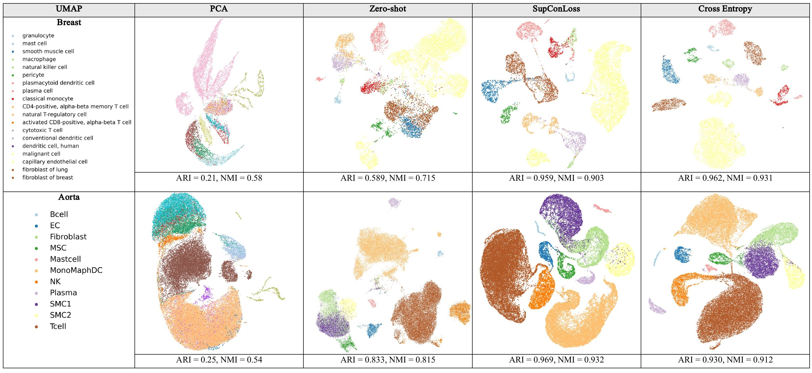

# Unsupervised Representation learning for Spatial transcriptomics

This Master project is based on [CellPLM: Pre-training of Cell Language Model Beyond Single Cells](https://openreview.net/forum?id=BKXvPDekud).


[](https://opensource.org/licenses/BSD-2-Clause)

***CellPLM*** is the first single-***Cell*** ***P***re-trained ***L***anguage ***M***odel that encodes cell-cell relations and it consistently outperforms existing pre-trained and non-pre-trained models in diverse downstream tasks.

## Summary of Contribution
<p align="center">
  
</p>

• **Codebase Extension**. The original CellPLM repository provided only limited tutorials (zero-shot clustering and fine-tuned cell type annotation). We extended the implementation to support:
1. Fine-tuned cell embedding clustering
2. Zero-shot inference for cell type annotation

• **Novel Clustering Pipeline**. We designed a new fine-tuning pipeline for clustering, systematically comparing three strategies:

– Self-supervised learning:
1. Decoder-based reconstruction loss — aligned with the original CellPLM pre-training objective, but yielded poor clustering quality (high reconstruction accu-
racy ̸⇒ meaningful embeddings).
2. KL-only latent loss — resulted in posterior collapse, with embeddings degenerating to the prior distribution.

– Supervised learning: Standard cross-entropy loss achieved the strongest absolute clustering performance (e.g., ARI > 0.9 in Mouse Brain2) but required full label supervision and was computationally very expensive.

– ***Supervised Contrastive learning (SupConLoss)***: Our introduced head achieved clustering performance competitive with cross-entropy loss while reducing training time by 30–300×, offering substantially greater scalability.

• **Key Finding**. SupConLoss provides a favorable trade-off between clustering performance and computational efficiency, making it a practical solution for large-scale or weakly labeled single-cell datasets.

See `juhaim_thesis_end.pdf` and the `image/` directory for full experimental results and illustrations.

<p align="center">
  
</p>

<p align="center">
  
</p>

## Quick start

1) Install dependencies

```bash
# Recommended: Python 3.9, CUDA >= 11.7
pip install -r requirements.txt
```

Or using conda (recommended for reproducibility):

```bash
conda create -n cellplm python=3.9 -y
conda activate cellplm
conda install cudatoolkit=11.7 -c pytorch -c nvidia
pip install -r requirements.txt
```

2) Inspect scripts and their options

```bash
python embedding_fit.py --help
python imputation_fit.py --help
python annotation_fit.py --help
```

## Pretrained CellPLM Model Checkpoints
The checkpoint can be acquired from [dropbox](https://www.dropbox.com/scl/fo/i5rmxgtqzg7iykt2e9uqm/h?rlkey=o8hi0xads9ol07o48jdityzv1&dl=0). 
[10/10/2023] The latest version is `20230926_85M`.

## Tutorials
We offer several [notebooks](https://github.com/OmicsML/CellPLM/tree/main/tutorials) for various downstream tasks as introductory tutorials. 

### Contribution ###
- `preporcess.py` — data preprocessing utilities
- `embedding_fit.py` — embedding & clustering fine-tuning
- `imputation_fit.py`, `imputation_fit2.py`, `imputation_zeroshot.py` — imputation training and zero-shot evaluation
- `annotation_fit.py`, `cell_type_annotation_zeroshot.py` — cell-type annotation training and zero-shot evaluation
- `pca.py` — visualization utilities (PCA) for embeddings
- `.ipynb` — Existing notebooks of CellPLM for hands-on examples 

Each script accepts command-line arguments for data paths, checkpoint paths, and hyperparameters. Use `--help` to see available options.

## Repository layout (important files)

- `CellPLM/` — core Python package (models, layers, utils)
- `ckpt/` — model checkpoints (`.ckpt`) and corresponding `.config.json` files
- `data/` — datasets (raw / preprocessed samples)
- `figure/` — figures used in the paper and experiment visualizations
- `logs/` — training logs
- `tutorials/` — example notebooks and finetuning
- `requirements.txt` — full dependency list
- `juhaim_thesis_end.pdf` — thesis PDF included in repository

## Paper / thesis and citation

This implementation and experiments are based on the CellPLM paper and thesis included in the repository.

Cite the paper as:

```
@article{wen2023cellplm,
  title={CellPLM: Pre-training of Cell Language Model Beyond Single Cells},
  author={Wen, Hongzhi and Tang, Wenzhuo and Dai, Xinnan and Ding, Jiayuan and Jin, Wei and Xie, Yuying and Tang, Jiliang},
  journal={bioRxiv},
  pages={2023--10},
  year={2023},
  publisher={Cold Spring Harbor Laboratory}
}
```


